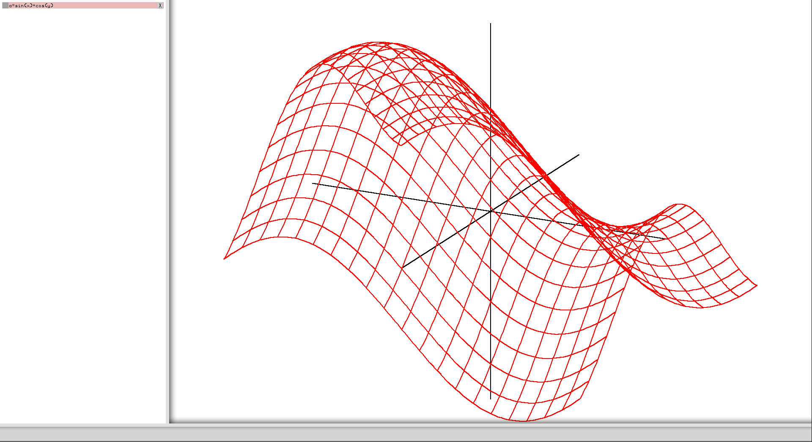

# Grapher3D
A program that allows the visualization of 2D and 3D functions using the GraphicsLibrary project as its graphical base



## Building/Dependencies

This uses the GraphicsLibrary project found at https://github.com/B-Ingwersen/GraphicsLibrary to provide graphical services. Currently that code has to be compiled with Grapher3D; see the comment by the include files in `Grapher3D.cpp` for more information.

On Ubuntu, this command can compile the project:

```
g++ Grapher3D.cpp -lSDL2 -lpthread -o Grapher3D
```

## Program Use

The program has 2D and 3D modes which can be switched between freely. Their visualization is shown in the main graph area (top right)

Equations are entered in the bar on the bottom; more details are provided below about what types of equations can be entered here

The side bar (left) shows previously entered equations. The box on the left can hide/show previously entered equations, and the "X" on the right will delete them

### Equation Entry

Basic math operators (`+, -, /, *, ^, ()`) are supported along with `sqrt`, trig functions, and inverse trig functions (use `arc` prefix). The constants `pi` and `e` are also built in.

For normal functions, type an expression (in terms of `x` in 2D mode, in terms of `x` and `y` in 3D mode) directly into the equation entry box.

A few additional structures can be displayed through the use of keywords:
- Points: `pt(x, y, [z in 3D mode])`
- 2D Parametric Equations: `param(x(t), y(t), min t value, max t value)`
- 3D Parametric Equations: `param(x(t), y(t), z(t), min t value, max t value)`

Note that an equation entered in 2D will NOT show up in 3D mode and vice versa; equations will be interpreted according to the current mode (therefore `2x` will add a line if in 2D mode and a plane if in 3D mode)

### Navigation/Shortcuts:
- `Ctrl+2`: switches to the 2D view
- `Ctrl+3`: switches to the 3D view
- `Ctrl+Space`: highlights the equation entry bar
- `Ctrl+h`: Resets the graph (recenters on origin and sets the default zoom)
- Drag the mouse on the graph area to pan in 2D mode and rotate the graph in 3D mode
- Scroll with the mouse in the graph area to zoom in or out

### Fun equations to try out
- `sin(x) + cos(y)` (3D mode)
- `param(sin(5t), cos(7t), 0, 2pi)` (2D mode)
- `param(cos(0.8t)cos(t), cos(0.8t)sin(t), 0, 10pi)` (2D mode)
- `curve(sin(t), cos(t), t/10, 0, 10pi)` (3D mode)
